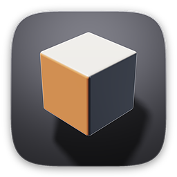
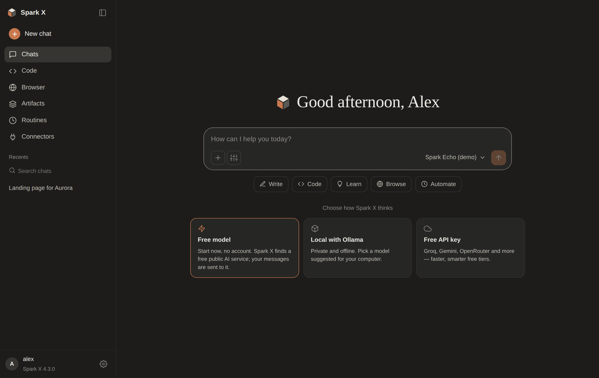
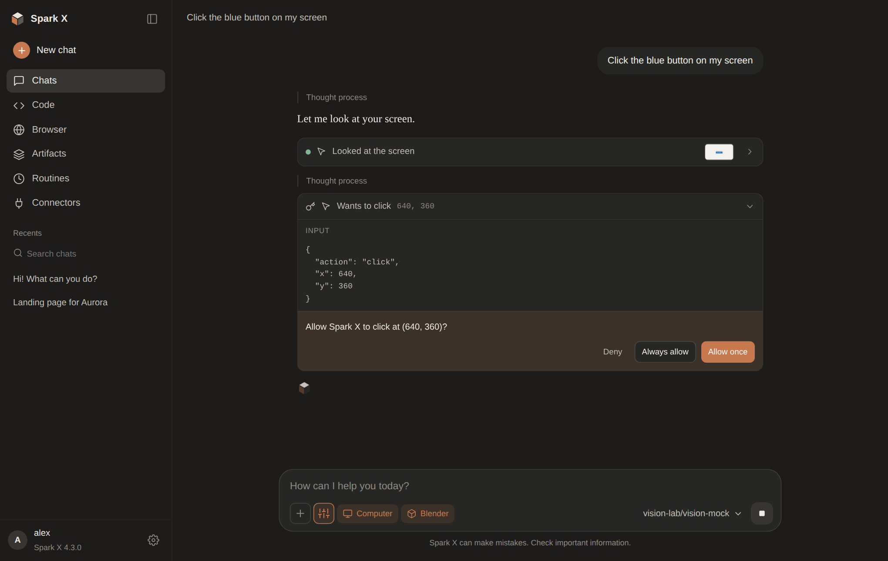
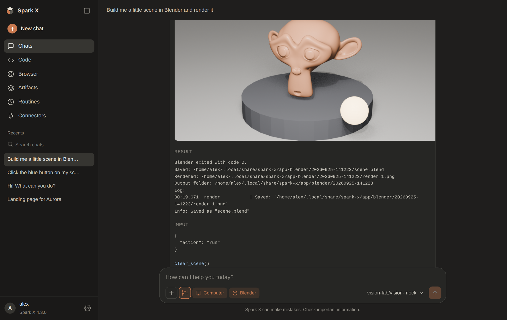
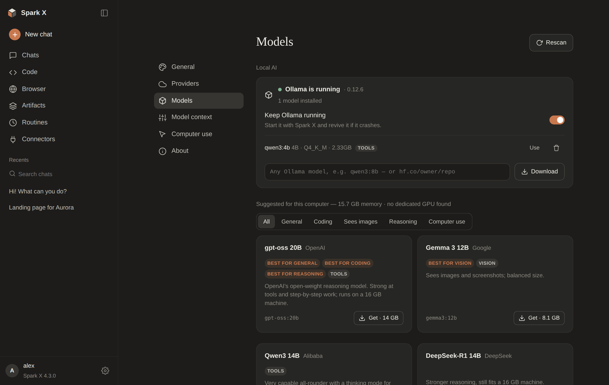
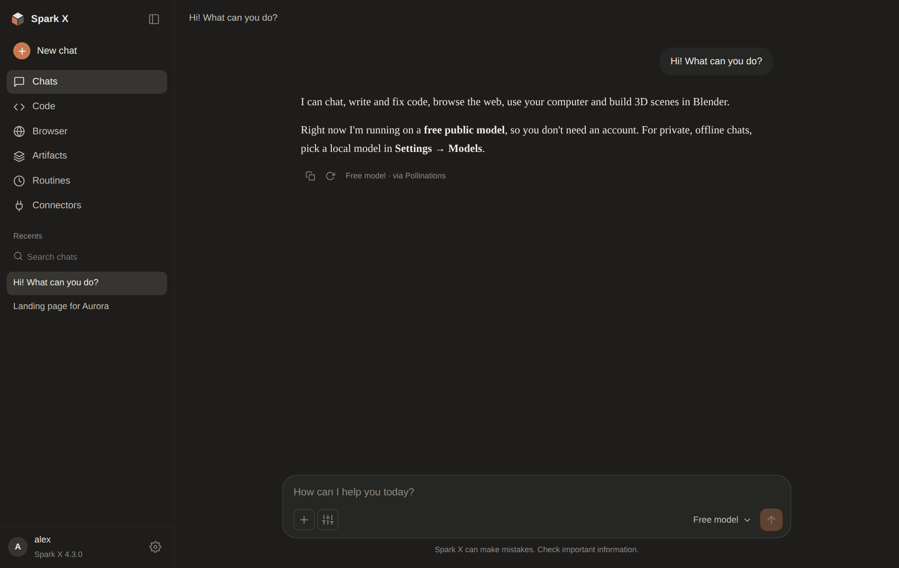
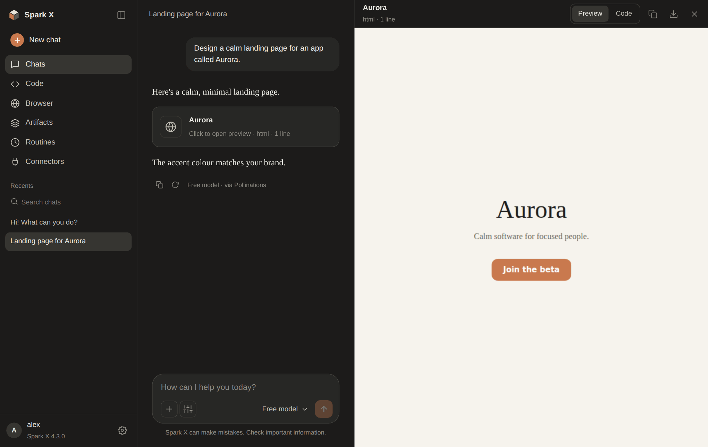
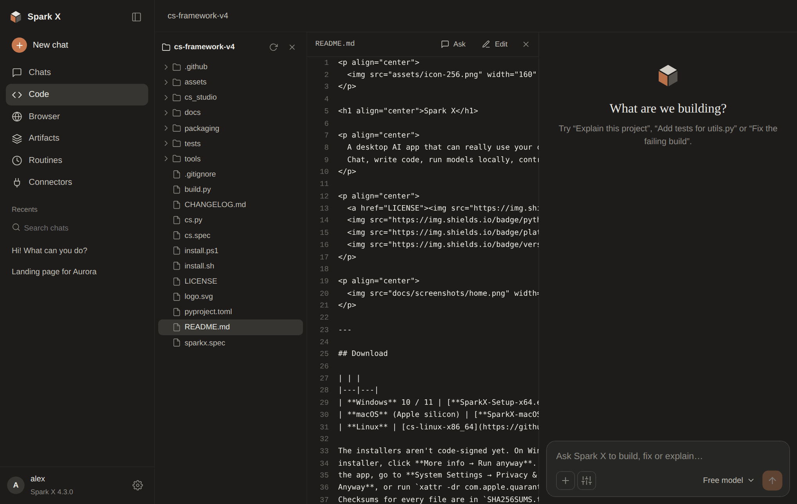

<p align="center">
  
</p>

<h1 align="center">Spark X</h1>

<p align="center">
  A desktop AI app that can really use your computer.<br>
  Chat, write code, run models locally, control the mouse and keyboard, and build 3D scenes in Blender.
</p>

<p align="center">
  <a href="LICENSE"></a>
  
  
  
</p>

<p align="center">
  
</p>

---

## Download

| | |
|---|---|
| **Windows** 10 / 11 | [**SparkX-Setup-x64.exe**](https://github.com/qulyttvv-beep/cs-framework-v4/releases/latest/download/SparkX-Setup-x64.exe): installs for your user (no admin prompt) and adds Spark X to the Start menu |
| **macOS** (Apple silicon) | [**SparkX-macOS-arm64.dmg**](https://github.com/qulyttvv-beep/cs-framework-v4/releases/latest/download/SparkX-macOS-arm64.dmg): open it and drag Spark X into Applications |
| **Linux** | [cs-linux-x86_64](https://github.com/qulyttvv-beep/cs-framework-v4/releases/latest/download/cs-linux-x86_64): `chmod +x cs-linux-x86_64 && ./cs-linux-x86_64 studio` |

The installers aren't code-signed yet. On Windows, if SmartScreen stops the
installer, click **More info → Run anyway**. On macOS, the first time you open
the app, go to **System Settings → Privacy & Security** and click **Open
Anyway**, or run `xattr -dr com.apple.quarantine "/Applications/Spark X.app"`.
Checksums for every file are in `SHA256SUMS.txt` on the
[release page](https://github.com/qulyttvv-beep/cs-framework-v4/releases/latest).

Spark X is a real app with its own window (WebView2 on Windows, WebKit on
macOS), not a browser tab. Your settings, chats and models are kept in your user
profile (`%APPDATA%\Spark X`, `~/Library/Application Support/Spark X`), so they
survive updates.

---

## What it does

- **Works the moment it opens.** Click **Free model** and Spark X finds a free
  public AI service that is answering right now (no account, no key) and switches
  to another if one goes down. The app says plainly that those messages go to that
  service; for private chats use a local model.
- **Runs models on your computer.** Spark X starts **Ollama** for you, keeps it
  running and restarts it if it stops. The **Models** page suggests current open
  models that fit your machine's memory, shows what's trending on Hugging Face,
  and downloads any of them with one click.
- **Uses your computer.** With **Computer use** on, the model sees your screen and
  moves the mouse, clicks, types, presses shortcuts, scrolls and opens apps,
  files and websites. It checks a fresh screenshot after every step, and each
  action asks for your permission first.
- **Makes things in Blender.** It writes Blender Python, runs it, and shows you
  the render right in the chat, saving the `.blend` alongside. With the Spark X
  bridge add-on it builds in the Blender you have open.
- **Everything else you'd expect:** chat with **artifacts** (live HTML / SVG /
  code previews), a **Code** workspace with an agent that edits your project,
  a built-in **browser**, **MCP connectors** (imports your Claude Desktop config),
  scheduled **routines**, and every model (free, local or cloud) in one picker.

<table>
  <tr>
    <td></td>
    <td></td>
  </tr>
  <tr>
    <td></td>
    <td></td>
  </tr>
  <tr>
    <td></td>
    <td></td>
  </tr>
</table>

Underneath is **`cs`**, a single-file local-LLM runner and agent hub (the
[framework](#the-cs-framework) below): model scanning, llama.cpp /
transformers / ONNX routing, an OpenAI-compatible server and coding-agent
connectors. The Windows installer includes it as the `cs` command; everywhere
else it's the single-file `cs` download.

---

## Using Spark X

### Pick a model

The model picker lists everything you can use:

| Where | How |
|---|---|
| **Free model** | One click, no signup. Spark X checks which keyless public services ([Pollinations](https://pollinations.ai), [LLM7](https://llm7.io)) are answering and uses the first that works, falling back to the next if it fails. The reply shows which service answered. Turn it off under *Settings → Providers*. |
| **On this machine** | Ollama models (download them on the *Models* page) and LM Studio, found automatically when they're running. Private and offline. |
| **Local files** | Every GGUF / safetensors / ONNX model `cs scan` finds, run with llama.cpp, transformers, … |
| **Free API tiers** | **Groq, Google Gemini, OpenRouter, Cerebras, Mistral, GitHub Models, Hugging Face, NVIDIA NIM, SambaNova**. In *Settings → Providers*, click **Get key**, sign in, paste the key; every model on the account shows up. |
| **Paid APIs** | OpenAI, DeepSeek, Together AI |
| **Anything else** | **Custom endpoint**: any OpenAI-compatible URL (vLLM, llama-server, LiteLLM, a company gateway …), with or without a key |

Keys are stored only on your computer and are never sent back to the window.
Spark X doesn't scrape websites or create accounts to get "free tokens": the free
option only uses services that are open to everyone by design, and every
provider above offers its free tier officially.

### Local models with Ollama

*Settings → Models* shows whether Ollama is installed and running (with a
**Get Ollama** button if it isn't). Spark X starts it when the app opens and,
with **Keep Ollama running** on, restarts it if it crashes or is closed.

**Suggested for this computer** is a hand-picked list of current open models
(gpt-oss, Qwen3, Gemma 3, Mistral Small, DeepSeek-R1, Magistral, Qwen3-Coder,
Devstral, Qwen2.5-VL, Phi-4 mini, Llama …). Each card shows its size, what it's
best at (general, coding, seeing images, reasoning, computer use) and whether it
fits your RAM / VRAM. **Trending on Hugging Face** lists popular GGUF models from
the last weeks. You can also type any Ollama model name or `hf.co/owner/repo`.
Downloads show progress and can be cancelled.

### Computer use

Turn on **Computer** in the tools menu (the sliders button in the message box)
and ask for something: *"Open Spotify and play my liked songs"*, *"Rename the
screenshots on my desktop by date"*. The model looks at the screen, then clicks,
double-clicks, drags, scrolls, types and presses keys (`ctrl+s`, `cmd+space` …),
and checks a new screenshot after each step. Before each action Spark X asks
**Allow once / Always allow / Deny**. If you choose *Always allow*, the Spark X
window gets out of the way while it works. To stop it at any time, push the
mouse into any corner of the screen.

Models that can see images (Gemma 3, Qwen2.5-VL, most cloud models) get the
screenshots. Other models are told they can't see the screen, so they stick to
keyboard shortcuts, `open` and terminal commands.

- **macOS:** allow Spark X under *System Settings → Privacy & Security* →
  **Accessibility** and **Screen Recording** the first time.
- **Linux:** works on X11. Under Wayland, screenshots and input depend on the
  compositor.
- From source, run `cs install computer` to add the libraries (the downloads
  already include them).

### Blender

Turn on **Blender** in the tools menu and ask: *"Model a low-poly island with a
lighthouse and render it"*. Spark X finds Blender (the standard install
locations, Steam, `PATH`, or the path you set in *Settings → Computer use*),
runs the model's script in the background, renders, and puts the picture in the
chat. The `.blend` file is saved with it. If rendering on the GPU isn't
possible, it renders with Cycles on the CPU instead.

To have it work in the Blender you have open, click **Install bridge** under
*Connectors → Blender*. The bridge is a small add-on that only listens on
`127.0.0.1` and only accepts requests carrying a random key that Spark X reads
from your user folder.

### Code, browser, connectors, routines

**Code workspace.** Open a project folder: file tree, viewer, editor, and an
agent that reads, greps, edits files and runs commands in that folder. Each
change it wants to make asks for your approval first. No model? **Download &
set up** fetches Qwen2.5-Coder (1.5B / 7B / 14B GGUF) and llama.cpp, and after
that it works fully offline.

**Built-in browser.** Search the web or open any address inside the app.
**Reader** mode turns a page into clean text, and **Ask Spark X about this
page** sends it into a chat. The model can use the same browser as a tool.

**Connectors (MCP).** Add Model Context Protocol servers from a gallery
(filesystem, memory, fetch, git, time, sequential-thinking) or by command, or
**import your Claude Desktop config** in one click. Their tools show up next to
the built-in ones.

**Routines.** Schedule prompts to run every N minutes or daily at a set time,
with any model and tools, and a run log.

**Settings.** Theme and accent, per-model context (system prompt, sampling,
GPU layers, context length), runtime status and installs, Hugging Face
downloads, and provider connections.

**Try it with nothing installed.** The built-in **Spark Echo** demo model lets
you explore the app (including artifacts) before you connect anything.

**Security.** The app only listens on `127.0.0.1`. Each launch creates a random
session token, and every API call must carry it. Requests from other origins
or with a foreign `Host` header (DNS rebinding) are rejected. Artifacts and
browsed pages render in sandboxed frames that cannot reach the API. File access
is limited to the project folder you opened, and anything that changes
something (commands, file edits, mouse and keyboard, Blender scripts) asks
first unless you've said *Always allow*.

---

## The cs framework

Everything above runs on `cs`, a single-file portable model runner, model
manager and coding-agent hub. You can use it on its own from a terminal:

- **Model scanning**: finds every `.gguf`, `.safetensors`, `.bin`, and
  `.onnx` across the Hugging Face cache, LM Studio, Ollama, and your own
  folders.
- **Runtime routing**: picks the right engine per model: llama.cpp
  (Python / CLI / server), transformers, Optimum/ONNX, vLLM, MLX,
  Ollama, any OpenAI-compatible endpoint, or a user plugin.
- **Chat, code, serve, bench**: talk to a model, run it in a
  ReAct-style coding loop with `bash`/`read`/`write`/`grep` tools,
  expose it as an OpenAI-compatible API, or measure tok/s.
- **Coding-agent connectors**: wire Claude Code, Codex, OpenCode,
  Aider, Goose, Open Interpreter, and Crush straight at a local model
  server with one command.
- **Custom-architecture support**: non-standard arch strings like
  `qwen35`, `bonsai`, `BonsaiForCausalLM` map to real transformer
  classes with a fallback chain.
- **Ternary kernel support**: Bonsai 2's `PQ2_0` / `PTQ1_0` tensor
  types route through the PrismML fork of llama.cpp automatically.
- **Incognito mode**: chat without writing anything to disk.
- **Portable data**: copy the folder to a USB stick or another laptop
  and everything comes with it.

## Install `cs`

### Single-file binaries (no Python needed)

The [latest release](https://github.com/qulyttvv-beep/cs-framework-v4/releases/latest)
also has the `cs` tool as one file per platform. It contains the whole app
too: `cs studio` opens Spark X in an app window of Edge / Chrome, or your
browser.

| Platform | Asset |
|---|---|
| Windows x64 | `cs-windows-x86_64.exe` |
| Linux x64 | `cs-linux-x86_64` |
| macOS (Apple Silicon) | `cs-macos-arm64` |

```bash
# macOS / Linux
chmod +x cs-linux-x86_64
./cs-linux-x86_64 studio          # open Spark X
./cs-linux-x86_64                 # interactive CLI
./cs-linux-x86_64 install-self    # optional: add `cs` to your PATH
```

On Windows, double-clicking `cs-windows-x86_64.exe` opens Spark X too (the
console hides itself). The single-file binary keeps its data in a `cs_data/`
folder **next to itself**, so you can carry the pair on a USB stick.

### With pip / pipx (Python users)

```bash
pipx install "cs-framework[studio] @ git+https://github.com/qulyttvv-beep/cs-framework-v4"
spark-x      # the app, in its own window
cs           # the CLI
```

(`[studio]` adds pywebview for the native window; leave it out for the CLI only.)

### Windows (from source)

```powershell
powershell -ExecutionPolicy Bypass -File .\install.ps1
cs
```

The installer fetches Python, Git, CMake, Ninja, MSVC Build Tools,
CUDA (if NVIDIA), and Ollama (optional), then runs the framework's own
`setup` wizard and registers the `cs` global command.

### Linux / macOS (from source)

```bash
chmod +x install.sh
./install.sh
cs
```

Uses `apt`, `dnf`, `yum`, `pacman`, or `brew` depending on the distro.

### Manual

If you already have Python 3.9+:

```bash
python cs.py setup
cs
```

---

## Quick start

```
cs                                     # interactive model chooser
cs studio                              # ⭐ the Spark X app
cs chat  <model>                       # chat
cs code  <model>                       # tool-augmented coding
cs run   <model> -p "explain X"        # one-shot prompt
cs serve --port 8686                   # OpenAI-compatible API
cs bench <model>                       # benchmark tok/s
cs ctx   <model>                       # edit system prompt / sampling / GPU
cs verify                              # integrity-check every model
cs incognito                           # nothing saved to disk

cs agents                              # list coding agents and status
cs agents install claude-code
cs agents launch  claude-code --model <model>
```

```
cs studio                 # open the app
cs studio --no-open       # just run it; open http://127.0.0.1:8799 yourself
cs studio --port 9000 --model "groq/llama-3.3-70b-versatile"
```

---

## Portable

`cs.py` reads and writes `cs_data/` next to itself. Copy the folder
anywhere — a USB stick, another laptop — and everything comes with it:

```
cs.py
cs_data/
├── models/       your .gguf files
├── chats/        per-model chat history (jsonl)
├── contexts/     system prompts, sampling params
├── cache/        scan / hash / verify caches
├── tools/        downloaded binaries
├── plugins/      drop-in runtime and architecture hooks
├── app/          Spark X: chats, routines, connectors, window profile
├── logs/
└── agents/       agent connector configs
```

Drop a file named `PORTABLE` next to `cs.py` to force local data-dir
mode even when `~/.cs` already exists.

### Build a portable zip

```bash
python build.py                    # cs-portable-YYYY-MM-DD.zip
python build.py --with-tools       # include downloaded binaries
python build.py --with-models      # include local models (huge)
```

---

## Commands

| Command | What it does |
|---|---|
| `cs` | Interactive chooser |
| `cs studio [--host H] [--port P] [--model M] [--no-open]` | Graphical desktop/web app |
| `cs setup [--full] [--quiet]` | First-time setup wizard |
| `cs install-self` | Register the `cs` command on PATH |
| `cs scan` | Rescan every model directory |
| `cs list` | Table of models, platforms, runtimes |
| `cs chat [model] [--incognito]` | Chat |
| `cs code [model] [--cwd DIR]` | Tool-augmented coding |
| `cs incognito [model]` | Chat with no history written |
| `cs run <model> -p PROMPT` | One-shot prompt |
| `cs bench <model> [-n N]` | Benchmark tok/s |
| `cs ctx <model>` | Edit context (system, sampling, GPU) |
| `cs verify [query] [--deep] [--online]` | Integrity check |
| `cs serve [--host H] [--port P] [--model M]` | OpenAI-compatible API |
| `cs install <target>` | Install runtime / platform / binaries |
| `cs connect <platform>` | Connect a remote API |
| `cs agents <list\|install\|launch> [id]` | Coding-agent hub |
| `cs plugin-init <name>` | Scaffold a plugin |
| `cs pull <name> [--only PAT]` | Download a model from Hugging Face |
| `cs ps` | List running `cs serve` processes |
| `cs stop [target]` | Stop running servers |
| `cs rm <model>` | Delete a model file from disk |
| `cs platforms` | List connectable API platforms + status |
| `cs health` | Runtime + server health panel |
| `cs doctor [--deep]` | System + runtime diagnostics |
| `cs bonsai-setup` | PrismML fork status + ternary models |
| `cs ll-log` | Tail the newest llama-server log |
| `cs export [zip]` | Package cs.py + cs_data |
| `cs selftest` | Run internal tests |
| `cs version` / `cs --version` | Print version and exit |
| `cs clean [--downloads]` | Clear caches |

### `cs install` targets

```
llama-cpp        llama-cpp-python (binary wheel)
llamacpp-bin     llama-cli + llama-server binaries
prism-fork       PrismML fork (ternary kernels for Bonsai 2)
transformers     transformers, tokenizers, accelerate, safetensors
torch            pytorch
onnx             onnxruntime
hub              huggingface_hub, hf_transfer
sentencepiece    sentencepiece, protobuf
einops           einops
tiktoken         tiktoken
computer         mss, pyautogui, pillow (computer use in Spark X)
aider            aider-chat
interpreter      open-interpreter
ollama           official Ollama install script
all              everything above
```

### `cs connect` platforms

```
openai       https://api.openai.com/v1
anthropic    https://api.anthropic.com/v1
lmstudio     http://localhost:1234/v1       (no key needed)
ollama       http://localhost:11434/v1      (no key needed)
openrouter   https://openrouter.ai/api/v1
groq         https://api.groq.com/openai/v1
together     https://api.together.xyz/v1
mistral      https://api.mistral.ai/v1
```

---

## Runtime selection

`cs` picks the first viable runtime per model:

| Order | Runtime | Handles |
|---|---|---|
| 1 | `llama-server` | `.gguf` (spawns a local server) |
| 2 | `llama-cli` | `.gguf` (fallback) |
| 3 | `llama.cpp-py` | `.gguf` (in-process) |
| 4 | `transformers` | `tf-dir`, `.safetensors`, `.bin` |
| 5 | `ollama` | Ollama manifests |
| 6 | `openai-compat` | Connected API platforms |
| 7 | plugins | `cs_api.register(...)` |

Set `CS_PREFER_PY=1` to put `llama.cpp-py` first.

Once a runtime succeeds for a model, it's cached per-model. If it
fails, the cache is dropped so the next attempt tries a different
runtime.

---

## Custom architectures

Non-standard architecture strings from GGUF metadata or `config.json`
are mapped to real transformer classes:

| Input | Maps to |
|---|---|
| `qwen35`, `qwen3.5`, `qwen3` | `Qwen3ForCausalLM` |
| `qwen2`, `qwen2.5`, `qwen25` | `Qwen2ForCausalLM` |
| `bonsai`, `bonsai2`, `BonsaiForCausalLM` | `Qwen2ForCausalLM` |
| `bonsai3` | `Qwen3ForCausalLM` |
| `llama`, `llama2`, `llama3`, `llama3.1`, `llama3.2` | `LlamaForCausalLM` |
| `mistral`, `mixtral` | `MistralForCausalLM` / `MixtralForCausalLM` |
| `gemma`, `gemma2`, `gemma3` | `Gemma*ForCausalLM` |
| `phi`, `phi3`, `phimoe` | `Phi*ForCausalLM` |
| `deepseek`, `deepseekv2`, `deepseekv3` | `Deepseek*ForCausalLM` |
| `granite`, `olmo`, `stablelm`, `falcon`, `mpt`, `bloom`, `rwkv` | corresponding class |

If the mapped class fails, transformers walks a fallback chain
(`AutoModelForCausalLM` → `Qwen2` → `Qwen3` → `Llama` → `Mistral` →
`Gemma2` → `Phi3`) until one loads.

### Custom architecture hooks

```python
# cs_data/plugins/my_arch.py
import cs_api
cs_api.register_arch("MyCustomForCausalLM",
                     lambda rec, prompt, ctx: iter(["hello"]))
```

---

## Bonsai 2 / ternary models

Ternary GGUFs use `PQ2_0` (type 142) and `PTQ1_0` (type 143) tensor
types plus a Hadamard activation transform — all of which require the
[PrismML fork of llama.cpp](https://github.com/PrismML-Eng/llama.cpp).

`cs` detects these three ways:

1. Filename contains `pq2`, `ptq1`, or `ternary`
2. GGUF `general.file_type` is 141, 142, or 143
3. GGUF metadata has any `prism.hadamard.*` key

Standard GGUF models keep using the normal runtime path.

Install the fork:

```
cs install prism-fork        # prebuilt binaries
cs bonsai-setup              # verify + list ternary models
```

### Expected speeds

| GPU | PTQ1_0 | PQ2_0 |
|---|---|---|
| RTX 3060 Ti 8 GB (prebuilt fork) | 8–12 tok/s | 6.3 tok/s |
| RTX 3060 Ti 8 GB (native sm_86) | 18–22 tok/s | 14–17 tok/s |

For fastest inference, rebuild the fork for your GPU's architecture
(Ampere `86`, Ada `89`, Blackwell `120`) using the Ninja generator —
this bypasses VS MSBuild integration and gives 2.5–3× the decode rate.

---

## Code mode

`cs code` runs a ReAct-style tool loop. The model emits tool calls:

```
<tool>{"name":"bash","args":{"cmd":"ls -la"}}</tool>
```

`cs` executes the tool and feeds the result back as:

```
<tool_result>...</tool_result>
```

Up to 12 rounds per task. Available tools:

| Tool | Args |
|---|---|
| `bash` | `{cmd:str}` |
| `read` | `{path:str, offset:int=0, limit:int=200}` |
| `write` | `{path:str, content:str}` |
| `append` | `{path:str, content:str}` |
| `ls` | `{path:str="."}` |
| `glob` | `{pattern:str, root:str="."}` |
| `grep` | `{pattern:str, root:str=".", glob:str="**/*"}` |
| `web_fetch` | `{url:str}` |

The system prompt auto-injects the tool spec. `--cwd` sets the working
directory for tool execution.

---

## Server

```bash
cs serve --host 127.0.0.1 --port 8686 --model "Qwen3-8B"
```

Endpoints:

| Endpoint | Description |
|---|---|
| `GET /v1/models` | List available models |
| `GET /health` | Health check |
| `POST /v1/chat/completions` | Chat (streaming and non-streaming) |
| `POST /v1/completions` | Text completion |

Compatible with the OpenAI Python SDK, `curl`, and any HTTP client. If
you pass `"stream": true`, the response uses SSE with `data:` prefix
and a final `data: [DONE]`.

---

## Coding agents

| Agent | Installer |
|---|---|
| **Claude Code** (Anthropic) | `npm install -g @anthropic-ai/claude-code` |
| **Codex CLI** (OpenAI) | `npm install -g @openai/codex` |
| **OpenCode** | `npm install -g opencode-ai` |
| **Aider** | `pip install aider-chat` |
| **Goose** (Block) | `curl -fsSL .../download_cli.sh` |
| **Open Interpreter** | `pip install open-interpreter` |
| **Crush** (Charm) | `go install github.com/charmbracelet/crush@latest` |

All launch through `cs agents launch <id> --model <model>`, which starts
a local OpenAI-compatible server and points the agent at it via
environment variables. No API keys needed — the agents talk to your
local model.

---

## Context editor

Every model has its own context, stored at
`cs_data/contexts/contexts.json`:

```json
{
  "ternary_bonsai_2_27b_abliterated_pq2_0_gguf": {
    "system": "You are a helpful assistant.",
    "n_ctx": 4096,
    "max_new_tokens": 512,
    "temperature": 0.7,
    "top_p": 0.95,
    "top_k": 40,
    "repeat_penalty": 1.1,
    "n_gpu_layers": 99,
    "threads": 8,
    "seed": -1
  }
}
```

Open with `cs ctx <model>` or press `[6]` in the chooser. System prompt
can be a single line, a multi-line block (type `::` to enter block
mode, `.` alone to end), or edited in `$EDITOR` (type `edit`).

---

## Plugins

Drop a `.py` file into `cs_data/plugins/`:

```python
import cs_api

class MyRuntime(cs_api.BaseRuntime):
    id = "my-runtime"
    kinds = ("tf-dir", "gguf")

    def available(self):
        return True, ""

    def can_run(self, rec):
        return rec.arch == "MyCustomArch" or rec.kind in self.kinds

    def stream(self, rec, prompt, hist, ctx):
        yield f"[my-runtime] handling {rec.name}"

cs_api.register(MyRuntime)
```

Available `cs_api` members: `BaseRuntime`, `register`, `register_arch`,
`log`, `normalize_arch`, `arch_alias_chain`, `DATA_HOME`.

---

## File layout

```
cs_data/
├── config.json          settings, connected platforms
├── models/              your model files
├── chats/               per-model chat logs (jsonl)
├── contexts/            per-model context presets
├── cache/               scan / hash / verify caches
│   ├── scan.json
│   ├── hashes.json
│   └── verify.json
├── bin/                 launcher for `cs` command
├── tools/               downloaded binaries
│   ├── llamacpp/        release binaries
│   └── llamacpp-prism/  PrismML fork (ternary support)
├── plugins/             user plugins
├── agents/              agent connector configs
└── logs/
    ├── cs.log           framework log
    └── llama-server-*.log  per-instance server logs
```

Model search paths scanned automatically:

- `cs_data/models`
- `~/.cache/huggingface/hub`
- `~/.lmstudio/models`
- `~/.ollama/models`
- `~/models`
- `./models` (current directory)
- `$CS_MODEL_PATHS` (environment variable)
- Anything added via `cs path <dir>`

---

## Environment variables

| Variable | Effect |
|---|---|
| `CS_HOME` | Override the data directory |
| `CS_MODEL_PATHS` | Extra model search paths (`:` or `;` separated) |
| `CS_NO_COLOR` | `1` disables ANSI colors |
| `CS_PREFER_PY` | `1` puts `llama.cpp-py` before binaries |
| `CUDACXX` | Path to a specific `nvcc` |
| `CUDA_PATH` | CUDA toolkit root |
| `OLLAMA_HOST` | Where Spark X looks for (and starts) Ollama, e.g. `127.0.0.1:11434` |
| `BLENDER_PATH` | The Blender executable to use |
| `SPARKX_NO_NATIVE` | `1` opens Spark X in an Edge / Chrome app window or your browser instead of its own window |
| `SPARKX_OFFLINE` | `1` skips the start-up network checks (free-model probe, catalog refresh) |

---

## Troubleshooting

**`cs chat` produces nothing, `~0.0 tok/s`**
Check `cs ll-log`. If you see `offloaded 0/N layers to GPU`, the model
is on CPU. Lower `n_gpu_layers` in `cs ctx` or install a CUDA-enabled
llama.cpp build.

**`HTTP Error 503: Service Unavailable`**
The server accepted TCP but hasn't finished loading. `cs` already polls
`/health`, but if you see this with an old build, ensure `_wait_health`
is present in `LlamaServerRT`.

**`No CUDA toolset found` when building from source**
CUDA was installed after VS Build Tools. Use the Ninja generator
(`-G Ninja`); it talks to `nvcc` directly and skips the MSBuild
integration.

**`nvcc fatal: Unsupported gpu architecture`**
Your `nvcc` version doesn't match the target arch. Pin `CUDACXX`:

```powershell
$env:CUDACXX = "C:\Program Files\NVIDIA GPU Computing Toolkit\CUDA\v12.4\bin\nvcc.exe"
```

**Model loads but output is gibberish**
Either the prompt format doesn't match the tokenizer's chat template
(use the `/v1/chat/completions` path, which applies it automatically)
or a ternary model is being loaded on mainline llama.cpp instead of
the PrismML fork. Confirm with `cs bonsai-setup`.

**Very slow on GPU (0.4 tok/s on a card that should do 60+)**
The prebuilt binaries were compiled for a generic CUDA architecture and
are falling back to slow kernels. Rebuild from source with your exact
architecture:

- Ampere (RTX 30xx): `-DCMAKE_CUDA_ARCHITECTURES=86`
- Ada (RTX 40xx): `-DCMAKE_CUDA_ARCHITECTURES=89`
- Blackwell (RTX 50xx): `-DCMAKE_CUDA_ARCHITECTURES=120`

---

## FAQ

**Does it phone home?**
No. There is no telemetry. It only makes network requests you ask for:
Hugging Face and GitHub for `pull` / `install`, the provider APIs you connect,
and the pages you open in the built-in browser.

**Can I run this offline?**
Yes. All local models work without network. Only `hub search/download`,
`install`, and `--online` verify need connectivity.

**Why single file?**
Portability. Copy `cs.py` anywhere, run it — no `pip install` of the
framework itself, no venv, no build. (Running from source, keep the
`cs_studio/` folder next to `cs.py` for the app. The prebuilt executable
already contains it.)

**Does it support multimodal models?**
Yes for LLaVA, Qwen2-VL, and similar — the transformers runtime loads
them like any other causal LM.

**Does it support LoRA adapters?**
Not built-in. Load them by editing the model's context `extra` dict and
passing to the runtime, or write a plugin.

**How do I add a runtime that isn't supported?**
Write a plugin (see **Plugins** above) or open an issue with the
model's format details.

---

## Build from source

The framework is pure standard library, so building needs only PyInstaller
(plus `mss pyautogui pillow` to bundle computer use, and `pywebview` for the
desktop app's window):

```bash
pip install pyinstaller mss pyautogui pillow pywebview
pyinstaller cs.spec            # -> dist/cs            single-file CLI (cs.exe on Windows)
pyinstaller sparkx.spec        # -> dist/Spark X/      the desktop app (+ cs) — macOS: dist/Spark X.app
```

`cs.spec` makes **one file** containing the CLI, the server, the app's
frontend (`cs_studio/static`), the Blender bridge and the icon. `sparkx.spec`
makes the installable app: `Spark X(.exe)` opens its own window with no
console, and `cs(.exe)` next to it is the CLI. The Windows installer is built
from that folder with [Inno Setup](https://jrsoftware.org/isinfo.php)
(`iscc /DAppVersion=4.3.0 packaging\sparkx.iss`); the macOS `.dmg` with
`hdiutil`. Model runtimes (torch, transformers, llama.cpp, …) are **not**
bundled. They are installed on demand with `cs install` (GGUF models use
downloaded llama.cpp binaries), which keeps the downloads small.

The app icon is rendered from code: `python tools/render_icon.py` ray-marches
the 3D mark with numpy and writes every PNG size plus `sparkx.ico` /
`sparkx.icns` into `assets/`.

Every release is built by the `Release` GitHub Actions workflow (on a `v*` tag,
or run manually with a tag name). It installs the Windows setup, opens the
real app window on Windows and macOS and waits for the UI to report ready,
smoke-tests the CLI binaries on all three platforms, and only then publishes.
Pull requests run the same packaging checks.

## Testing

```bash
python cs.py selftest          # fast built-in checks
pip install pytest && pytest   # full suite in tests/
```

CI runs the syntax check, `selftest`, and the pytest suite on Linux, macOS, and
Windows across Python 3.9–3.12 on every push and pull request, and on pull
requests also builds and runs the installers.

## Contributing

1. Fork the repository.
2. Create a feature branch: `git checkout -b feature/my-thing`.
3. Run `python cs.py selftest` and `pytest` before opening a PR.
4. Keep the framework in `cs.py`, with no new imports at module scope unless
   they are wrapped in a try/except. The Spark X frontend is plain
   HTML/CSS/JS in `cs_studio/static/`, with no build step and no gradients.

---
--thanks claude

## License

MIT — see [LICENSE](LICENSE).
